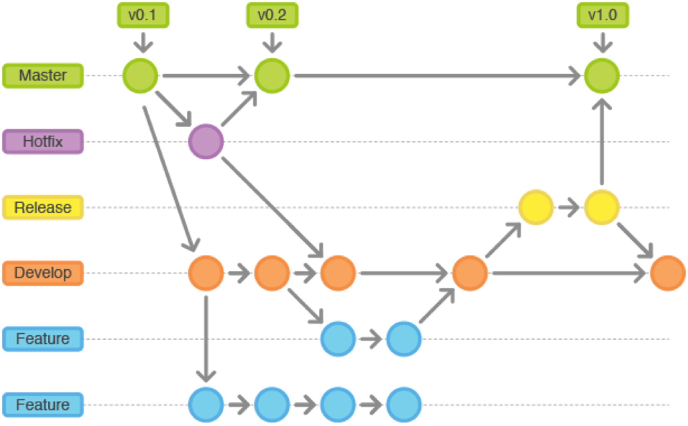

# Tarea Tema 18 Entornos 
CREA UN REPOSITORIO PÚBLICO EN GITHUB CON LAS SIGUIENTES RAMAS Y SIMULA EL SIGUIENTE FLUJO DE TRABAJO. 

## explicación

1. **Primer paso**  
    - Creamos un proyecto y lo publicamos en nuestro repositorio

2. **Segundo paso**     
    - Creamos las ramas necesarias Hotfix, Release, Develop, Feature y Feature 2        

3. **Tercer paso**
    - Hacemos 3 commits en feature 2

4. **Cuarto paso**
    - Hacemos un commit en develop

5. **Quinto paso**
    - Hacemos un commit en main y develop

6. **Sexto paso**
    - Hacemos merge en en los dos con hotfix

7. **Séptimo paso**
    - Hacemos un commit en main, develop y feature

8. **Octavo paso**
    - Hacemos un merge de feature en develop

9. **Noveno paso**
    - Hacemos un commit en develop, feature y release

10. **Décimo paso**
    - Hacemos un merge de release en develop y main 
